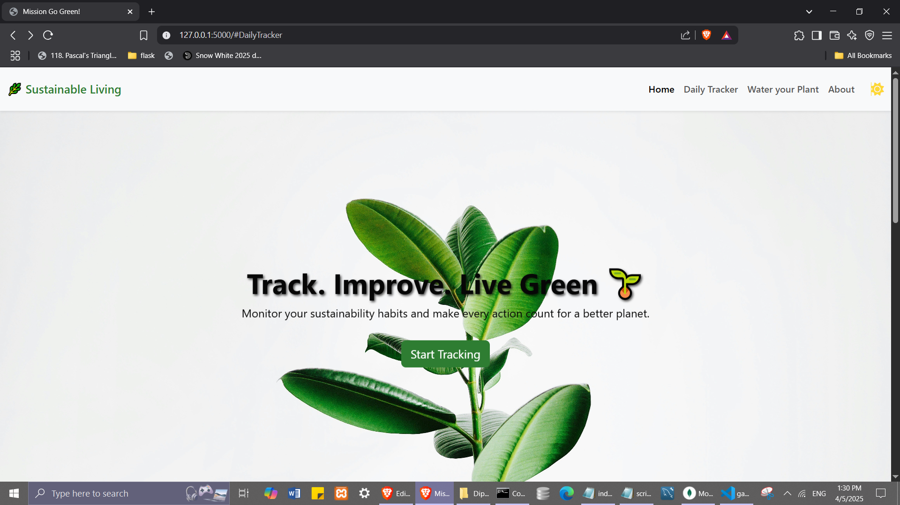
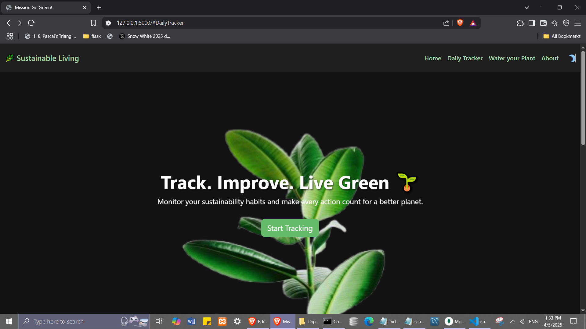
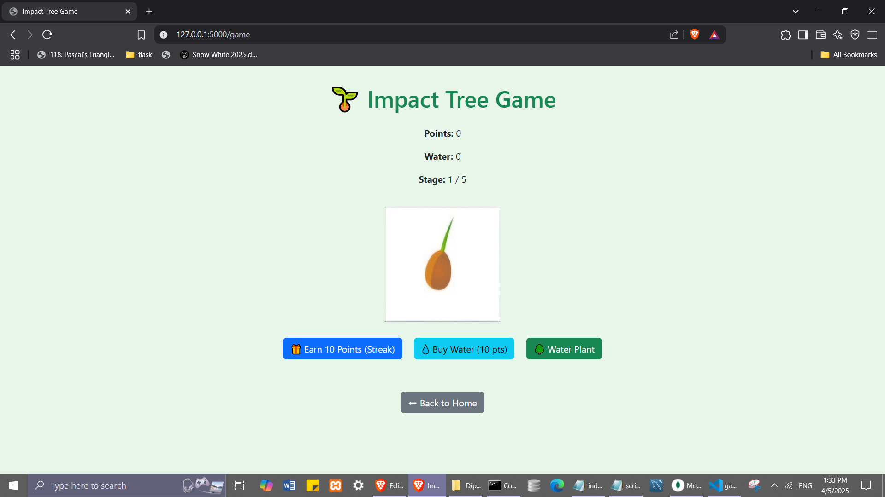
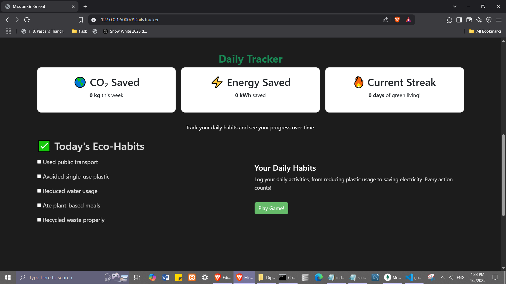
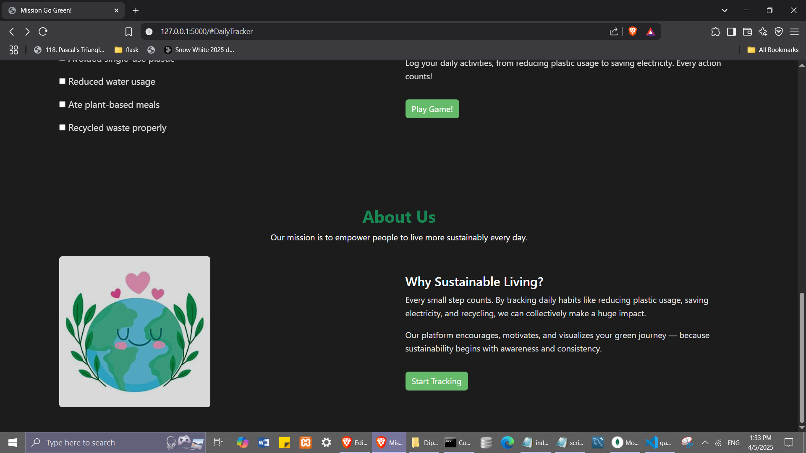

#
# 🌿 Sustainable Living Tracker + Impact Tree Game 
Welcome to Mission Go Green! — an interactive platform designed to help individuals live more sustainably by tracking eco-habits and playing a gamified tree-planting experience.

## ✨ Features
###### ✅ Daily Eco-Habit Tracker
###### 🌱 Gamified Tree Growing Experience
###### 🌗 Light/Dark Theme Toggle
###### 📊 Live Stats for CO₂ and Energy Savings
###### 🎮 Reward System with Points and Water

## 📷 Screenshots

### Main Section

### Twist : Implement Dark Theme

### Final Twist : Implement Game

### Extra Feature: User Daily Tracker 

## 🔧 Technologies Used
**Frontend**: HTML5, CSS3, Bootstrap 5, JavaScript

**Backend:** Flask (Python)

**Database:** MongoDB

**Icons:** FontAwesome

## How It Works
- Track daily sustainable habits like using public transport, reducing plastic, etc.

- Earn points for consistent eco-actions (via streaks).

- Spend points to buy water.

- Water your virtual tree and grow it through 5 stages.

- On stage 5, celebrate — a real tree will be planted in your name (conceptually).
